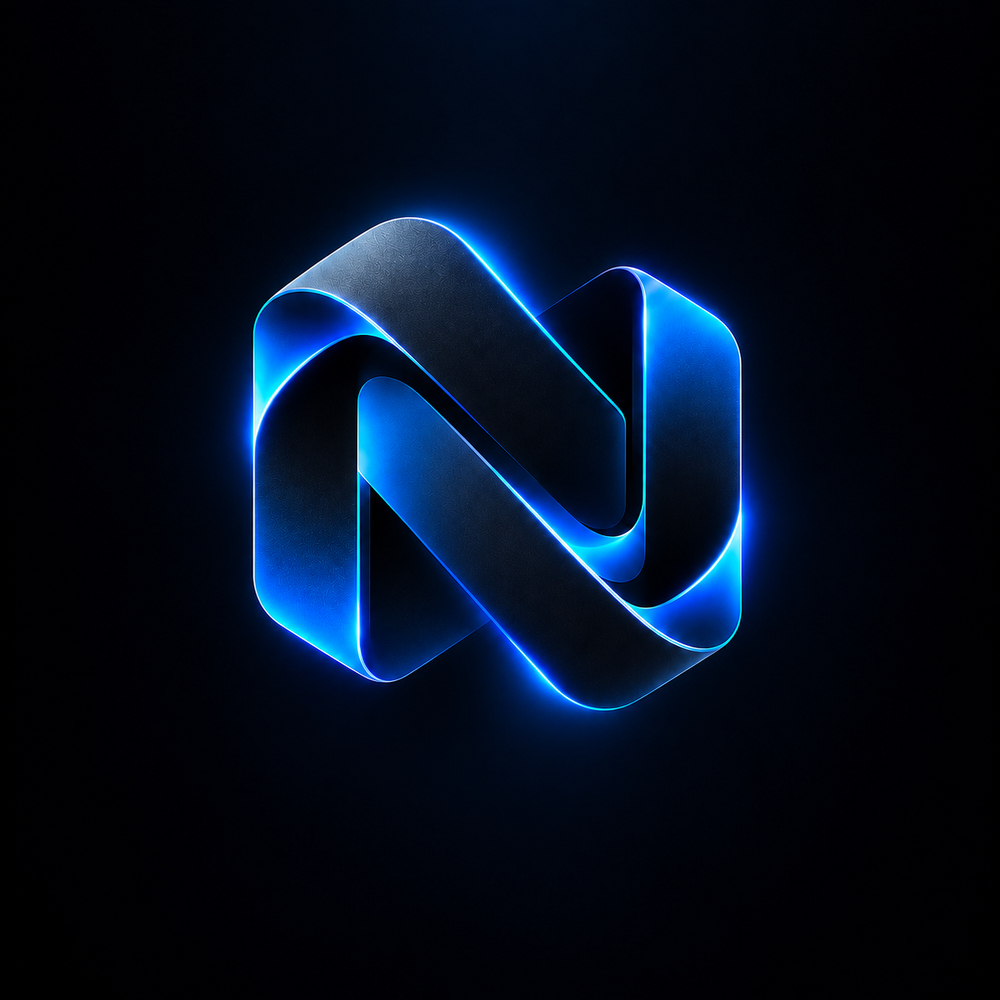
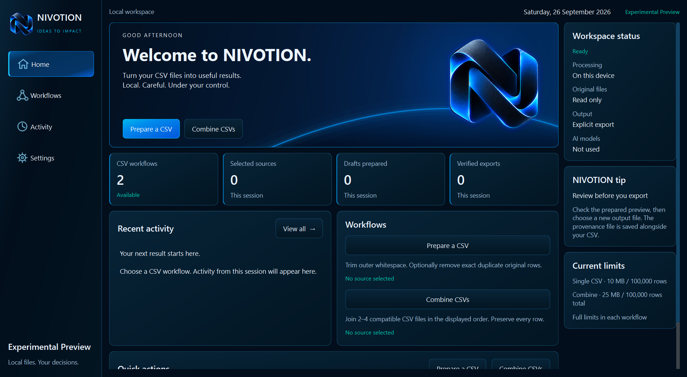

# NIVOTION · First Public Experimental Preview

Prepare and combine CSV files on your Windows desktop. Review the draft, then explicitly choose where to export it.

**0.1.0-rc.1 · Windows x64 · English / Čeština · Dark / Light**

This is NIVOTION's first public Experimental Preview. It is an early build, so rough edges are expected. Every useful bug report, confusing moment, workflow idea, missing detail and general impression helps us improve it. Suggestions are welcome; they are not roadmap commitments.

This preview is not stable, final or production-certified.

Use of the NIVOTION application is subject to the [NIVOTION Experimental Preview License](LICENSE.md). Third-party components remain under their respective licenses.

## What you can do today

| Workflow | Current behavior |
| --- | --- |
| Single CSV | Trim outer cell whitespace and optionally remove exact duplicate original rows. |
| Combine CSVs | Vertically append 2–4 compatible CSVs in the displayed order; preserve whitespace and duplicate rows. Headers must be identical, unique and in the same order. |

Original files stay unchanged. **DRAFT_PREPARED** means a draft is ready for review, not that it was exported or a downstream action succeeded. Explicit export creates a new CSV and its provenance JSON sidecar. Existing output destinations are refused.

## Download and run

Use the **nivotion** product repository's [Releases route](PUBLIC_LINKS.md#download) and select **NIVOTION 0.1.0-rc.1 — First Public Experimental Preview** (`v0.1.0-rc.1`). Download `NIVOTION_0.1.0-rc.1_WINDOWS_X64_EXPERIMENTAL_PREVIEW.zip`, not GitHub's generated source-code archives. If the release is absent, no public download is available yet.

[Install and verify SHA256](INSTALL.md) · [Quickstart](QUICKSTART.md) · [Limits](KNOWN_LIMITATIONS.md)

The Windows executable is unsigned; SmartScreen may warn. The installation guide explains verification and the per-file decision without disabling protections globally.

## Tell us what you notice

Normal reports live in **nivotion-feedback**, the separate community repository under the same GitHub owner:

- [Report a bug](PUBLIC_LINKS.md#bug-reports).
- [Share confusing UX](PUBLIC_LINKS.md#ux-feedback).
- [Suggest an improvement](PUBLIC_LINKS.md#improvement-ideas).
- [Share early impressions, ask questions or join a discussion](PUBLIC_LINKS.md#discussions).

Do not upload private or sensitive CSV contents. If data is needed, create a tiny synthetic CSV that reproduces the issue. Redact names, emails, customer data, local paths, tokens and private business data from screenshots, logs and attachments.

Čeština je vítaná. Napište nám, co nefungovalo, co bylo nejasné nebo co by vám pomohlo. Neposílejte soukromá CSV ani citlivé údaje.

For vulnerabilities, use the [private security route](SECURITY.md). Product Issues and Discussions are not the normal feedback channel. Security vulnerabilities belong in the product repository's private vulnerability reporting mechanism, never in public Issues or Discussions. If the private route is unavailable, wait until it is enabled; do not post the details publicly.

## Interface and information

[Workflows](assets/screenshots/workflows.png) · [Combine](assets/screenshots/combine-csv.png) · [Activity](assets/screenshots/activity.png) · [Settings](assets/screenshots/settings.png) · [Light Mode](assets/screenshots/home-light.png)

[Privacy](PRIVACY.md) · [Support](SUPPORT.md) · [Checksums](CHECKSUMS.md) · [Release history](RELEASE_HISTORY.md) · [Third-party notices](THIRD_PARTY_NOTICES.md)

This repository provides product documentation and media; the Windows package is a Release asset. It does not publish the NIVOTION application source. Included third-party library sources and LGPL rights do not make NIVOTION's proprietary application source open source.
